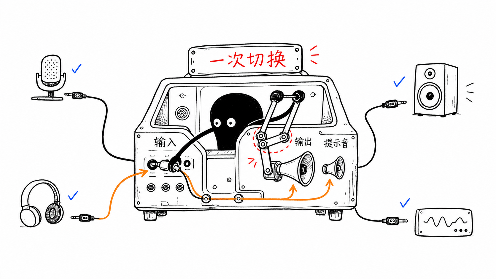

# AudioSwitch

AudioSwitch 是一个原生 macOS 菜单栏应用，用于快速选择系统默认输入和输出设备。选择输出设备时，应用会同步修改主输出和系统提示音输出。



## 功能

- 显示全部可用的内置、蓝牙、USB、显示器、AirPlay、虚拟及聚合音频设备
- 分开选择默认输入和输出设备
- 输出切换失败时恢复原来的主输出与系统提示音输出
- 实时响应设备连接、断开和系统默认设备变化
- 支持开机自动启动
- 不连接蓝牙设备、不采集音频，也不请求麦克风权限

## 本地开发

最低运行版本为 macOS 13。当前工程使用 Swift Package Manager，不依赖第三方库。

```sh
swift build
swift run AudioSwitchCoreChecks
```

生成本机测试安装包：

```sh
./tools/package_local_dmg.sh
./tools/verify_local_package.sh
```

本地包采用 ad-hoc 签名，只用于开发验证，不适合公开分发。

## 公开发布

公开安装包需要 Apple Developer Program 账号、Developer ID Application 证书，以及保存在钥匙串中的 `AudioSwitch-notary` 公证凭据。

保存公证凭据：

```sh
xcrun notarytool store-credentials AudioSwitch-notary \
  --apple-id "your-apple-id@example.com" \
  --team-id "TEAMID" \
  --password "app-specific-password"
```

生成 Universal 2、Developer ID 签名并完成 Apple 公证的 DMG：

```sh
DEVELOPER_ID_APPLICATION="Developer ID Application: Your Name (TEAMID)" \
  ./tools/release_notarized_dmg.sh
```

正式产物为：

- `AudioSwitch-v0.1.4-macOS-universal.dmg`
- `AudioSwitch-v0.1.4-macOS-universal.dmg.sha256`

## 许可证

本项目使用 [MIT License](LICENSE)。
